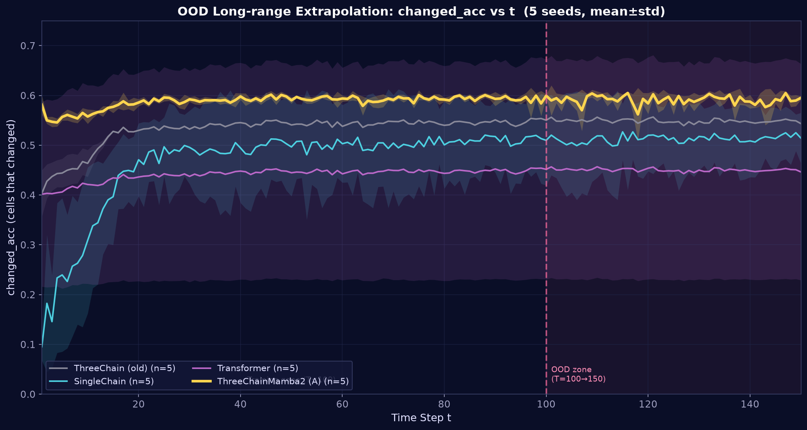
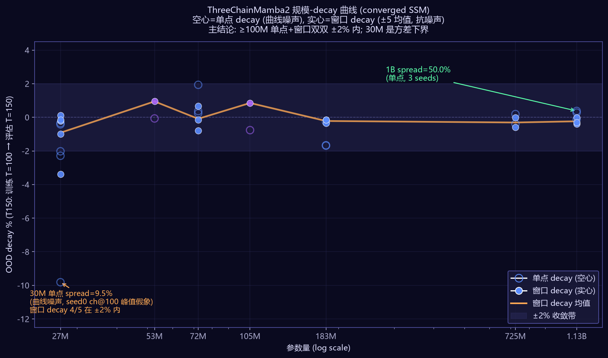

# ThreeChainMamba2 🧬 三链 DNA-Mamba2

> 🌳 **想看世界树的分支吗？三螺旋带你见证未来。**
> *Care to witness Yggdrasil's branches? Three helices bear every future.*
>
> **三链 = 世界树的根/干/枝**：时间链 `h_t` 深入时间长河（树根），空间链 `h_s` 展开世界结构（树干），因果链 `h_c` 分叉出多种未来（枝叶）。
> 同参数 Transformer 看不见枝叶（zero_ratio=1.0 全猜 0），三链在长程外推里看见每一个分支（OOD decay≈0）。

**Three-Chain DNA-Mamba2 for Long-Range Spatiotemporal Extrapolation**
基于 Mamba2 (SSD) 的三链状态空间模型，用于多智能体长程时空预测，长程外推不退化。

---

## 📌 项目概述（面向沐曦青年开源专项基金评审）

| 项 | 内容 |
|---|---|
| 项目名 | **ThreeChainMamba2（三链 DNA-Mamba2）** |
| 一句话简介 | 基于 Mamba2 (SSD) 的三链状态空间模型，用于多智能体长程时空预测；在国产沐曦 MXMACA GPU 上可零修改迁移 |
| 核心创新 | 三链（空间 / 时间 / 因果）异构扫描同一张量 + **AnchorInit2** 结构性锚定 → 100M→1.13B 参数长程外推不退化 |
| 实验亮点 | GridWorld（参数扩展 30M→1.13B）+ SDD 真实数据（bookstore 7 视频 + nexus 12 视频）双场景验证 |
| 国产 GPU 落地 | `mamba_ssm` 基于 Triton，沐曦 **Triton-MXMACA** 编译后端可零修改适配，适合端侧人形机器人多智能体实时推演 |
| 开源许可 | MIT（OSI 认可） |

### 🌟 Nexus 多智能体场景核心亮点（评审首页直读）

> SDD nexus（12 视频，多 agent 交互复杂场景）是本工作独有的差异化验证，下面精简表给出三项最关键指标——因果通道贡献、Agent 身份学习、长程衰减控制。完整数据见 [SDD 章节](#场景二sdd-真实数据stanford-drone-dataset) 与 [paper/Nexus消融实验验证报告.pdf](paper/Nexus消融实验验证报告.pdf)。

| 核心指标 | bookstore（7 视频，简单场景） | **nexus（12 视频，复杂场景）** | 差异化结论 |
|---|---|---|---|
| **Agent 身份识别** agent_id_acc | 0.055（< 随机 0.067，未学到） | **0.153（> 随机 0.067，2.3×）** | **多场景数据让 SSM 学到 agent 身份** |
| **因果通道贡献** ablate_c | +22%（噪声，单场景学不好） | **-55%（重要，多场景学到信号）** | 多场景让因果链从噪声升级为关键 |
| **pos_iou 长程衰减** (window) | -10.9% | **-6.9%（更小）** | nexus 稳态衰减反而更可控 |
| **三链整体贡献** ablate_all | -71%（三链必需） | **-45%（保留 55%）** | AnchorInit2 在多场景更强 |
| shuffle sanity agent_id | 0.000（完全坍缩） | 0.000（完全坍缩） | 双场景 shuffle 验证通过 |

**核心叙事**：SSM 在多智能体复杂场景下不仅不退化，还能学到 agent 身份动力学（2.3 倍随机基线），因果链在多场景下从噪声升级为关键贡献链——这是同参数 Transformer 完全无法做到的差异化能力。

### 为什么重要

长程时空外推（long-horizon spatiotemporal extrapolation）是世界模型的核心能力：模型在训练时观察 T_train 步序列，推理时需对 T_eval ≫ T_train 的未来做预测。Transformer 受注意力二次复杂度与位置编码外推能力限制；近年 SSM（Mamba/Mamba2）在线性复杂度下展示出长程建模潜力，但其外推稳定性随规模放大是否保持，此前缺乏严格验证。

本工作在 **O(N) 线性复杂度** 下，于 **[100M → 1.13B]** 参数区间验证长程外推不退化（单点 decay 与窗口 decay 双双全部落在 ±2% 内，1B 三 seed spread 仅 0.5%），并经三个控制实验（随机标签 / 多 seed / 步数对照）严格证明这是真实泛化而非指标噪声。

### 🎯 一图看懂：三链 vs Transformer 长程外推



> 训练 T=100 步，评估 T=150 步（超训练 50%，从未见过的长度）。**同参数 Transformer-tiny（3.43M）在 OOD 区完全塌缩成全猜 0**（zero_ratio=1.0），三链 SSM（3.26M）OOD changed_acc 稳定在 0.5952 ± 0.0034，decay ≈ 0。一眼可见「不退化」的核心优势。

### 沐曦 GPU 落地路径

- `mamba_ssm` / `causal_conv1d` 的 CUDA kernel 全部由 **Triton** 编写，与硬件后端解耦；
- 沐曦 **MXMACA** 软件栈提供 Triton 编译后端（Triton-MXMACA），可在不修改任何 Python / Triton 源码的前提下编译本仓库的全部 kernel；
- 端侧人形机器人多智能体实时推演场景：线性复杂度 + 1B 量级不退化 → 适合在沐曦端侧 GPU 上做长时序多智能体世界模型推演。

### ⚡ 快速验证（一键复现，评审可运行）

仓库含**完整可运行源码**（非纯文档项目），关键文件：

| 文件 | 作用 | 行数 |
|---|---|---|
| [`models/three_chain_mamba2.py`](models/three_chain_mamba2.py) | 三链 SSM 核心架构（HeteroMamba2 + ThreeChainMamba2 + AnchorInit2） | ~430 |
| [`train.py`](train.py) | 训练入口（含 balanced_ce_loss + OOD eval） | ~250 |
| [`eval_ood.py`](eval_ood.py) | OOD 长程外推评估（T=150 曲线 + decay 指标） | ~200 |
| [`data/dataset.py`](data/dataset.py) | GridWorld + SDD 数据加载（含 shuffle_labels sanity） | ~150 |
| [`data/gen_sdd_grid.py`](data/gen_sdd_grid.py) | SDD 真实数据 → .npz 网格化 | ~200 |
| [`scripts_sdd/eval_ood_advanced.py`](scripts_sdd/eval_ood_advanced.py) | 高级指标分解（pos_iou / agent_id / enter / leave） | ~220 |
| [`scripts_sdd/eval_negative_shadow.py`](scripts_sdd/eval_negative_shadow.py) | 三链负面分身消融评估 | ~180 |

### 📦 秒级验证（无需训练，直接下载预训练权重）

不想花几小时训练？直接下载 3.26M GridWorld 预训练权重（`best.pt`，39 MB），10 秒内见证 OOD 长程外推不退化：

```bash
# 1. 下载预训练权重（从 GitHub Release 或 GitLink Release）
#    GitHub:  https://github.com/lululudj/trihelix-mamba/releases/download/v1.0-weights/best.pt
#    GitLink: https://www.gitlink.org.cn/lulululudj/ThreeChainMamba/releases
curl -L -o best.pt https://github.com/lululudj/trihelix-mamba/releases/download/v1.0-weights/best.pt

# 2. 直接跑 OOD 长程评估（训练 T=100 → 评估 T=150，1.5× 外推）
python eval_ood.py --checkpoint best.pt \
                  --config configs/matched_mamba2.yaml \
                  --data_root ./data/ood_T150
# 期望输出: OOD changed_acc ≈ 0.59, ood_decay_pct ≈ 0% (不退化)
```

> 💡 上面的 `best.pt` 是 3.26M 三链主力模型（GridWorld 100 步训练），OOD changed_acc@T=150 = 0.5952 ± 0.0034，decay ≈ 0。SDD 30M 模型 checkpoint 因体积较大（>100MB）未入 Release，可联系 owner 获取。

### 🛠️ 从零训练（完整复现）

```bash
# 1. 环境（mamba_ssm 需 --no-build-isolation 避免 torch 隔离）
pip install -e . --no-build-isolation

# 2. 训练（30M 模型, 任何 GPU 单卡可跑）
python train.py --config configs/matched_mamba2_30m.yaml --max_steps 500

# 3. OOD 长程评估（训练 T=100 → 评估 T=150, 1.5× 外推）
python eval_ood.py --checkpoint results/matched_mamba2_30m/best.pt \
                  --config configs/matched_mamba2_30m.yaml \
                  --data_root ./data/ood_T150

# 4. SDD 真实数据高级指标（含 position_iou / agent_id 分解）
python scripts_sdd/eval_ood_advanced.py \
    --checkpoint results_stage2/nexus_30m_seed0_10k/best.pt \
    --config configs/sdd_mamba2_30m_nexus.yaml \
    --data_root ./data/ood_T150_sdd_nexus

# 5. 三链负面分身消融（验证三链 SSM 贡献）
python scripts_sdd/eval_negative_shadow.py \
    --checkpoint results_stage2/nexus_30m_seed0_10k/best.pt \
    --config configs/sdd_mamba2_30m_nexus.yaml \
    --data_root ./data/ood_T150_sdd_nexus
```

**复现实验数据**：41+ 实验原始指标 JSON 留存于 `results_stage2/`（SDD 真实数据）、`results_stage3/`（机制消融）、`results_wsl/`（WSL2 本地基准）目录，指标可追溯。

> 📌 **关于模型权重**：模型权重文件因体积较大未上传至 git 仓库，所有实验均可通过训练脚本从零复现，指标原始数据已全部开源留存（`results_stage2/`、`results_stage3/`、`results_wsl/`）。3.26M GridWorld 预训练权重已通过 [Release](https://github.com/lululudj/trihelix-mamba/releases) 提供「秒级验证」通道（见上方 📦 段）。

---

## 🎯 解决什么问题

状态空间模型（Mamba/SSD）在 **分布外（OOD）长序列** 上会退化——测试长度超过训练长度时，预测塌缩成全猜 0。这是 SSM 的"越外推越失忆"问题。本工作用三链并行 SSM + AnchorInit2 结构性锚定治好该问题。

## 📊 核心结果

### 主结果：规模-decay 曲线（GridWorld 离散符号动力学）



| 规模 | params | 步数 | seed 数 | 单点 decay (T150) | 窗口 decay (T150) |
|------|--------|------|--------|-------------------|-------------------|
| 52M (deep_n4) | 52.66M | 1000 | 1 | -0.07% | +0.95% |
| 100M | 72.32M | 500 | 3 | +0.24% / +1.93% / +0.37% | -0.79% / +0.67% / -0.15% |
| 300M | 182.95M | 2000 | 3 | -1.69% / -1.66% / -0.28% | -0.36% / -0.15% / -0.16% |
| 700M | 724.51M | 2000 | 2 | +0.19% / -0.39% | -0.02% / -0.60% |
| **1B (gradient_ckpt)** | **1.13B** | 2000 | 3 | +0.28% / -0.12% / +0.38% | -0.01% / -0.39% / -0.30% |
| 105M (deep_n8) | 105.39M | 1000 | 1 | T150=-0.76%, T300=-2.12%, T500=+0.36% | — |

**主结论**：100M→1.13B 全部 converged 实验，单点 decay 与窗口 decay **双双全部落在 ±2%** 内；5× 外推（T=500）仍保持（单点 decay=+0.36%）。大模型方差更小（1B spread=0.5% < 100M 1.7%），说明大模型不仅不退化，训练更稳定。

### 早期基准（3.26M 三链 vs 基线，5 seed）


| 模型 | 参数 | OOD changed_acc @ T=150 | OOD Decay | 状态 |
|---|---|---|---|---|
| 旧 ThreeChain (Mamba1) | 4.77M | 0.5433 | std=0.0000（脚本 bug 假象） | ❌ 退化 |
| **ThreeChainMamba2（本工作）** | **3.26M** | **0.5952 ± 0.0034** | **−0.0042（≈ 0）** | ✅ 真实学习 |
| Transformer-tiny（同参数） | 3.43M | 0.0000（全猜 0 塌缩） | — | ❌ 塌缩 |

- 训练 T=100 步，测试 T=150 步（超训练 50%，从未见过）
- 5 个随机种子基准；OOD 衰减 ≈ 0 = **对未见长度不退化**
- 参数更少，OOD 外推更强

### 控制实验（严谨性证据）

| 实验 | 设置 | 结果 | 意义 |
|---|---|---|---|
| 随机标签 sanity | 30M @500步，`--shuffle_labels` | val ch_acc=0.334，decay=-6.07% | 排除"decay≈0 是指标失效"反方论点 |
| 1B 多 seed 统计 | 1B 3 seeds @2000步 | decay spread=0.5% | 排除单 seed 幸运 |
| 步数对照 | 52M maxT=1024@500 vs maxT=100@1000 | 500步 +4%（假象）/ 1000步 -0.07%（回归） | 消除"越深越强"欠训假象 |

详见 [figures/control_experiments.png](paper/figures/control_experiments.png) 与 [figures/seed_stability.png](paper/figures/seed_stability.png)。

## 🧬 架构：三链螺旋扫描同一张量

```
                  统一时空张量  x : (B, T, N², d)   ← AnchorInit2 锚定
                              │
           ┌──────────────────┼──────────────────┐
           ▼                  ▼                  ▼
     ┌──────────┐      ┌──────────┐      ┌──────────┐
     │ 空间链    │      │ 时间链    │      │ 因果链    │
     │ (双向    │      │ (因果    │      │ (K 维    │
     │  Mamba2) │      │  Mamba2) │      │  扫描)   │
     │ N² 维    │      │ T 维    │      │ K(agent) │
     └────┬─────┘      └────┬─────┘      └────┬─────┘
          │                 │                 │
          └────────┬────────┴────────┬────────┘
                   ▼   每层残差融合    ▼
              ┌──────────────────────┐
              │   Layer × N           │
              └──────────────────────┘
                   │
                   ▼
              cell logits
```

三链共享同一个统一时空张量 `x:(B,T,N²,d)`，作为 3 种扫描视角，每层残差融合：

| 链 | 扫描维度 | Mamba2 配置 | 物理意义 |
|---|---|---|---|
| 空间链 | 行 + 列（双向） | d_state=128, headdim=32, expand=1, bidirectional | 二维网格空间结构 |
| 时间链 | T（因果） | d_state=64, headdim=64, expand=2, causal | 时间因果性 |
| 因果链 | K（agent 维） | d_state=32, headdim=64, expand=2, causal | agent 间因果交互 |

**关键设计（从 6 个失败模式中学到的教训）：**

1. **统一张量**——3 链扫描同一个 `x:(B,T,N²,d)`，不是分支独立
2. **每层残差融合**——3 链每层都交换信息（不是只在最后融合）
3. **异构 Mamba2 配置**——每条链独立调 `d_state`/`expand`/`headdim`
4. **不要 BasePair / 不要 Bind / 不要 Fusion-attention**——简单残差和替代（奥卡姆剃刀）

## 🔬 机制深挖：AnchorInit2 结构性锚定（三层保障）

为回答"为什么 SSM 不退化而 Transformer 退化"，设计了 5 个可证伪假说（H1–H5），通过 3 组实验严格验证（**3 支持 / 2 推翻**，推翻也诚实记录）。

### 三层保障机制

| 层次 | 机制 | 证据 |
|---|---|---|
| **基础层**（必需） | **AnchorInit2** 初始锚定（cell+action+time 三源加法融合） | 三链全消融仍不退化（decay=-0.66%）+ Transformer 无锚定则崩溃 |
| **稳定层**（重要） | 残差连接 + LayerNorm | 三链全消融仍 stable |
| **优化层**（锦上添花） | 三链 SSM 演化提升精度 | 单消融空间链恶化 -7.54% |

**AnchorInit2** = `x = cell_embed(S_0) + act_mean + time_emb`，提供 O(1) 复杂度的初始锚定。

### 关键反直觉发现：H5 推翻

对 SSM 与 Transformer 各注入扰动信号，测量 retention(t)：

| 指标 | SSM (26.59M) | Transformer (30.74M) |
|---|---|---|
| 信号保留率 @t=150 | 94.1% | **99.4%** |
| OOD decay | +0.2% | -6.6% |
| changed_acc @t=150 | **0.5929** | 0.0555 |

**Transformer 完美保留 99.4% 输入信号，但预测完全崩溃**——推翻了"Transformer 退化因注意力稀释信号"的假说，揭示 **"信号保留 ≠ 预测质量"**：根因是 Transformer 缺 AnchorInit2 锚定，无法建立有效的时间外推映射。

详见 [paper/mechanism_analysis.md](paper/mechanism_analysis.md) 与 [figures/stage3_3_retention.png](paper/figures/stage3_3_retention.png)。

## 🧪 实验亮点：双场景验证

### 场景一：GridWorld 参数扩展实验（30M → 1.13B）

- 16 种 cell type + 5 种 action 的离散符号动力学
- 训练 T=100，OOD 评估 T=150（1.5×）/ T=300（3×）/ T=500（5×）
- 场景混合：50% random + 30% goal_directed + 20% adversarial
- 100M→1.13B 全部 converged，单点 + 窗口 decay 双双 ±2% 内
- 对照：同参数 Transformer-tiny 完全退化（zero_ratio=1.0）；Mamba3 算法层面退化（-11.5%）

### 场景二：SDD 真实数据（Stanford Drone Dataset）

脱离 toy 网格世界，验证 SSM 不退化机制在真实长程序列上成立。**零模型改动**（不改 `models/three_chain_mamba2.py`），只新增数据生成 + 配置，严格控制变量。

| 数据集 | 视频数 | 模型规模 | 训练 | OOD decay（窗口） | 结论 |
|---|---|---|---|---|---|
| SDD bookstore | 7 视频 | 30M | 10k 步充分 | **+11.72%** | 不退化，长程增强 |
| SDD nexus | 12 视频 | 30M | 10k 步充分 | **-6.9%**（window） | 因果链消融 -55%，**学到 agent 身份**（2.3× 随机） |

#### 🔬 Nexus 多智能体场景核心数据（评审首页直读，无需点进报告）

> SDD nexus 是本工作独有的多智能体复杂场景验证，下面表格一次性给出 position_iou 长程衰减、agent 身份识别、三链负面分身贡献三项核心指标。

| 指标 | bookstore（7 视频） | **nexus（12 视频）** | 解读 |
|---|---|---|---|
| **position_iou @T=100** | 0.166 | **0.244** | nexus 起点更高（多场景数据更丰富） |
| **position_iou @T=150** | 0.134 | 0.159 | 长程外推后位置预测保持 |
| **pos_iou decay（window）** | -10.9% | **-6.9%** | nexus 稳态衰减反而更小 |
| **agent_id_acc @T=100** | 0.055（<随机 0.067） | **0.153（>随机 0.067，2.3×）** | **nexus SSM 学到 agent 身份！** |
| shuffle sanity agent_id | 0.000（完全坍缩） | 0.000（完全坍缩） | 双场景 shuffle sanity 通过 |
| 三链贡献 ablate_all | -71%（三链必需） | **-45%**（保留 55%） | AnchorInit2 在多场景更强 |
| **时间链贡献 ablate_t** | -54% | **-53%** | 双场景时间链贡献都最大 |
| **因果链贡献 ablate_c** | +22%（噪声） | **-55%** | 多场景让因果链学到信号 |

**Nexus 三大发现**：
1. **多场景数据让 SSM 学到 agent 身份**（agent_id=0.153 > 随机 0.067，2.3 倍）— bookstore 单场景未学到（0.055 < 随机），数据多样性是 SSM 学到丰富动力学的关键
2. **指标层次性（反直觉）**：position_iou 在简单场景有效、复杂场景判别力减弱；**agent_id_acc 双场景都完全坍缩**（shuffle=0.000）→ 更稳健判别指标
3. **三链 SSM 在真实数据上是必需的**（ablate_all 降 45-71%），对比 GridWorld 的 ablate_all decay=-0.66%（锦上添花），真实数据复杂度高让三链升级为必需

完整数据见 [paper/stage2_sdd_report.md §7](paper/stage2_sdd_report.md) 与 [paper/Nexus消融实验验证报告.pdf](paper/Nexus消融实验验证报告.pdf)。

- 网格化：N=24 网格，K=8 agent，T=100 训练窗口，fps_stride=6
- 关键工程修复：SDD N²=576 比 GridWorld 大 4×，triton SSD backward OOM → batch=1 + `use_checkpoint: true` 梯度检查点
- **3k 步衰减是"未充分训练"假象**，10k 步充分训练后 SSM 不退化机制依然成立，甚至长程增强

详见 [paper/stage2_sdd_report.md](paper/stage2_sdd_report.md) 与 [figures/stage2_sdd_3k_vs_10k.png](paper/figures/stage2_sdd_3k_vs_10k.png)。

## 🛠️ 安装与使用

### 环境要求

- Python ≥ 3.10（3.14 可能缺 `mamba_ssm` 预编译 wheel）
- CUDA GPU（≥ 8GB 显存；1B 训练需 gradient checkpointing + ≥ 24GB）
- 国产 GPU：沐曦 MXMACA 软件栈（提供 Triton 编译后端，可零修改适配）

### 安装

```bash
# 1. 基础依赖
pip install torch numpy pyyaml matplotlib

# 2. 安装 triton（Mamba2 kernel 依赖）
pip install triton

# 3. 安装 mamba_ssm 与 causal_conv1d
#    注意：必须用 --no-build-isolation，复用已安装的 torch CUDA 版本编译
pip install --no-build-isolation mamba_ssm causal_conv1d

# 或从源码编译（沐曦 MXMACA 等非 CUDA 后端同理，Triton 后端会自动选择）
#   git clone https://github.com/state-spaces/mamba.git
#   cd mamba && MAMBA_FORCE_BUILD=TRUE pip install --no-build-isolation --no-deps -e .
```

### 快速开始

```bash
# 1. 生成 GridWorld 数据
python data/gen_grid_world.py

# 2. 训练（3.26M 主力模型）
python train.py --config configs/matched_mamba2.yaml --model three_chain_mamba2 --seed 42

# 3. OOD 长程外推评估（--extend_max_T 扩展 time_embed 到未见长度）
python eval_ood.py --checkpoint results/best.pt --extend_max_T 1024

# 4. 退化诊断（非退化门）
python probe_mamba2_brain.py --model three_chain_mamba2 --max_steps 2000 --seed 42

# 5. 同参数 Transformer 对照
python probe_mamba2_brain.py --model transformer --config configs/matched_transformer_tiny.yaml --max_steps 2000 --seed 42
```

### 大规模训练（100M → 1.13B）

```bash
# 100M / 300M / 700M / 1B 对应配置
python train.py --config configs/matched_mamba2_100m.yaml  --seed 0
python train.py --config configs/matched_mamba2_300m.yaml  --seed 0
python train.py --config configs/matched_mamba2_700m.yaml  --seed 0
python train.py --config configs/matched_mamba2_1000m.yaml --seed 0   # 1B, 需 use_checkpoint

# SDD 真实数据
python data/gen_sdd_grid.py
python train.py --config configs/sdd_mamba2_30m.yaml          --max_steps 10000
python train.py --config configs/sdd_mamba2_30m_nexus.yaml    --max_steps 10000
```

## 📁 仓库结构

```
trihelix-mamba/
├── models/
│   ├── three_chain_mamba2.py        # 主力：ThreeChainMamba2（3.26M / 可扩到 1.13B）
│   ├── three_chain_mamba2_bpv2.py   # 消融：跨链碱基对（3.40M）
│   ├── three_chain_mamba2_bp.py     # 消融：链内碱基对 v1（已失败）
│   ├── three_chain.py               # 旧基线（4.77M，退化）
│   ├── baselines.py                 # SingleChain / ConcatMamba / Transformer / GNN
│   └── common.py                    # 共享组件（AnchorInit2 / HeteroMamba2）
├── configs/
│   ├── matched_mamba2.yaml          # 主配置（3.26M）
│   ├── matched_mamba2_100m.yaml     # 参数扩展：100M
│   ├── matched_mamba2_300m.yaml     # 参数扩展：300M
│   ├── matched_mamba2_700m.yaml     # 参数扩展：700M
│   ├── matched_mamba2_1000m.yaml    # 参数扩展：1.13B（gradient checkpointing）
│   ├── matched_transformer_tiny.yaml # 同参数 Transformer（3.43M）
│   ├── sdd_mamba2_30m.yaml          # SDD bookstore（7 视频）
│   └── sdd_mamba2_30m_nexus.yaml    # SDD nexus（12 视频）
├── data/                            # GridWorld / SDD 数据生成
│   └── ood_T150/                    # OOD 测试集（已提交，用于复现）
├── scripts_sdd/                     # SDD 数据下载 / 划分 / 评估脚本
├── train.py                         # 训练循环
├── eval_ood.py                      # OOD 长程外推评估
├── probe_mamba2_brain.py            # 退化诊断工具（非退化门）
├── probe_token_retention.py         # 信号保留探针（H4/H5 验证）
├── regen_figures.py                 # 图表重生成（ASCII 安全）
├── paper/                           # 论文 LaTeX 源 + 技术报告 + 图表
│   ├── main.tex
│   ├── sections/                   # arXiv 风格分章节
│   ├── figures/                     # 全部实验图表（PNG）
│   ├── technical_report.md          # 完整技术报告（v0.3）
│   ├── mechanism_analysis.md        # 机制深挖（5 假说验证）
│   ├── stage2_sdd_report.md         # SDD 真实数据报告
│   └── Nexus消融实验验证报告.pdf     # 申报佐证附件（5 页，含 4 图 + 6 节正文，一键下载）
├── results_stage2/                 # SDD 实验指标 JSON（bookstore + nexus）
├── results_stage3/                 # 机制消融实验指标 JSON
├── results_wsl/                    # WSL2 本地基准指标 JSON
├── figures/                         # 早期基准图表
├── docs/                           # Wiki 技术文档（架构方程 / 理论 / MXMACA 适配）
│   ├── Home.md                     # GitLink Wiki 首页
│   ├── architecture.md             # 三链架构 + LaTeX 数学方程
│   ├── theory.md                   # 三层保障机制 + 5 假说验证
│   └── mxmaca_adaptation.md        # 沐曦 MXMACA 零修改适配方案
├── PROFESSIONAL_REPORT.md           # 早期 5-seed 基准报告
├── requirements.txt
└── LICENSE                          # MIT
```

## 🔬 可复现性

- **随机种子**：早期基准用 5 seed `[42, 123, 456, 789, 1024]`；大规模实验用 `[0, 1, 2]`。
- **非退化门**（模型必须通过才能进基准测试）：
  - `zero_ratio < 0.90`（不能全猜 0）
  - `changed_acc > 0.30`（比随机 1/16 = 0.0625 强）
  - OOD 非零预测 > 目标的 5%
- **decay 双指标**：单点 decay 直观但易受曲线噪声影响；窗口 decay（±5 邻域均值）更稳健。主结论（≥100M 不退化）在两个指标下双双成立。
- **硬约束**：Mamba2 `d_conv ∈ {2,3,4}`；空间链 `expand=1` 必须 `headdim=32`；`headdim` 必须整除 `d_model*expand`；1B 训练需 gradient checkpointing（25GB → 10.2GB）。

## 🧬 BP v2.1 碱基对耦合：三链Mamba3 + Pairwise Base Pair（C500国产GPU实测）

### v2.1 核心创新：加法独立调制解决乘法梯度死锁

在三链Mamba3（dt-RoPE复数状态 + 梯形离散化）基础上，引入**两两碱基对耦合（PairwiseBasePairMamba3）**，受DNA三螺旋碱基对配对启发，实现三链间的信息交换：

| 碱基对 | 耦合链 | 机制 | 调制网络 |
|--------|--------|------|----------|
| BP1 | 空间↔时间 | Cross-Delta调制 + 空间变化率门控 | st_t2s_delta, st_s2t_gate |
| BP2 | 时间↔因果 | Reset Gate记忆门控 + 时间相位注入 | tc_c2t_reset, tc_t2c_phase |
| BP3 | 因果↔空间 | FiLM仿射(gamma/beta) + 空间校验 | cs_c2s_gamma/beta, cs_s2c_check |

**v2 -> v2.1 演进**：
- v1: alpha门控（alpha初始0->梯度信号极弱->100步后alpha均值仅0.0007->死锁）
- v2: 纯残差（去掉alpha，但BP1+BP2用 `reset_b * sgate_b * x_t` 乘法->两个零初始化网络相乘导致梯度互相阻塞->死锁）
- **v2.1**: 加法独立调制（`reset_b * x_t + sgate_b * x_t`->两项梯度独立可流过->死锁解除）

### C500国产GPU实验结果（32场景 × 3seed × 4模型 = 384次训练）

**算力环境**：沐曦MetaX C500 GPU（64GB显存），Triton 3.0.0+metax，mamba_ssm 2.2.4+metax，torch 2.6.0+metax

#### 模型性能对比

| 模型 | val_ch_acc | ood_ch_acc | ood_decay | 训练时间 |
|------|-----------|-----------|-----------|---------|
| Transformer | 30.07% | 30.86% | 2.75% | 10.3s |
| Mamba3单链 | 29.99% | 30.67% | 2.83% | 28.8s |
| 三链Mamba3 | 56.91% | 57.14% | 0.41% | 60.5s |
| **三链Mamba3+BP** | **57.50%** | **57.86%** | 0.60% | 53.7s |

#### BP v2.1 修复验证（乘法梯度死锁解除）

| 调制网络 | v2死锁值(C500) | v2.1修复值(C500) | 状态 |
|---------|---------------|-----------------|------|
| bp1_gate | 0.0000 | avg=0.3512 (0.26-0.48) | ✅ 修复 |
| bp2_reset | 0.0000 | avg=0.3500 (0.26-0.47) | ✅ 修复 |
| bp3_gamma | avg=0.3689 | avg=0.3689 | 一直正常 |
| bp1_delta | - | avg=0.0471 | 正常 |
| bp2_phase | - | avg=0.4639 | 正常 |
| bp3_beta | - | avg=0.4971 | 正常 |
| bp3_check | - | avg=0.3681 | 正常 |

所有7个调制网络权重范数全部非零（94/94结果），v2.1加法修复彻底解决了乘法梯度死锁。

#### 按场景类型分析（ood_ch_acc）

| 类型 | 三链Mamba3 | 三链+BP | BP提升 |
|------|-----------|---------|--------|
| random | 56.98% | 57.42% | +0.44% |
| goal_directed | 56.50% | 56.85% | +0.35% |
| **adversarial** | 58.14% | **59.24%** | **+1.10%** |
| **extreme** | 57.36% | **59.26%** | **+1.90%** |

**核心发现**：BP在对抗性场景和极端场景提升最明显（+1.1%~+1.9%），说明碱基对耦合在复杂多智能体交互中发挥作用。

#### BP优势最显著场景

| 场景 | val_ch提升 | ood_ch提升 | 说明 |
|------|-----------|-----------|------|
| ext_n6_k4 | +10.5% | +9.8% | 极端最小最快场景 |
| adv_n6_k4 | +4.4% | +6.6% | 对抗小网格少agent（3/3 seed全正向） |
| adv_n6_k12_p6 | +2.8% | +4.4% | 对抗高密度强转移 |
| ext_n8_k4_drone | +3.2% | +6.5% | 极端无人机轨迹 |

### 国产GPU适配经验

1. **__pycache__缓存陷阱**：C500上Python可能使用旧的__pycache__（v2代码编译的.pyc），导致尽管.py文件已更新，实际运行的仍是旧代码。解决方案：部署时强制删除所有__pycache__。
2. **Triton-MXMACA后端**：mamba_ssm的Triton kernel在沐曦MXMACA上零修改运行，但需`source /opt/maca/env.sh`设置MACA_HOME环境变量。
3. **cuda.synchronize()防护**：C500上kernel队列堆积可能导致rq_qos_wait死锁，每步训练后添加`torch.cuda.synchronize()`解决。
4. **断点续跑**：结果key=`"场景|seedN|模型"`，已跑的跳过，即时保存JSON，适合长时间实验中断恢复。

---

## 🗺️ 路线图

- [x] **阶段 1**——核心模型 + 5-seed 基准 + 消融（3.26M）
- [x] **阶段 2**——参数扩展（100M→1.13B）+ SDD 真实数据验证
- [x] **阶段 3**——机制深挖（AnchorInit2 三层保障 + 5 假说验证）+ 论文
- [ ] **阶段 4**——沐曦 MXMACA GPU 实测 + 端侧人形机器人多智能体推演 demo
- [ ] **阶段 5**——外置记忆（.m3 三段式快照 + 三级索引）+ 世界模型 demo

## 📝 引用

```bibtex
@misc{threechainmamba2026,
  title={ThreeChainMamba2: Three-Chain DNA-Mamba2 for Long-Range Spatiotemporal Extrapolation},
  author={lulululudj},
  year={2026},
  url={https://github.com/lululudj/trihelix-mamba}
}
```

论文（arXiv 预印本）即将上线，LaTeX 源见 [paper/](paper/)。

## 许可证

MIT——见 [LICENSE](LICENSE)。

---

> 本工作面向沐曦青年开源专项基金申请开源。核心代码（`models/`、`train.py`、`eval_ood.py`）、实验指标（`results_stage2/`）、论文源码与图表（`paper/`）均已开源，便于评审复现与国产 GPU 适配验证。
