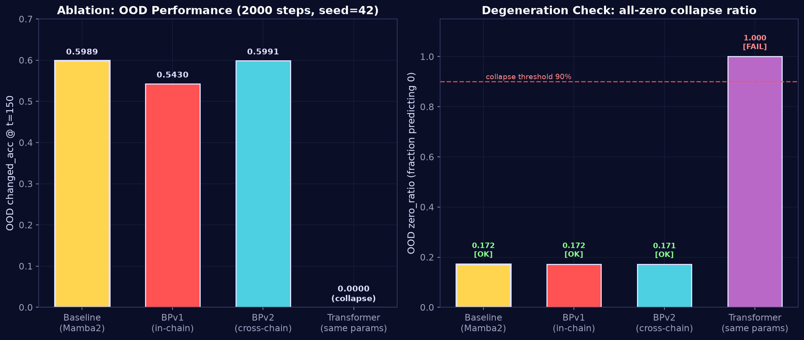

# TriHelix-Mamba 🧬 三螺旋-Mamba

### Three-Chain DNA-Mamba2 for Long-Range State Extrapolation
### 三链 DNA-Mamba2 长程状态外推模型

> 🇬🇧 [English](#english) | 🇨🇳 [中文](#中文)
>
> A unified-tensor SSM architecture that cures OOD degradation — 3 chains (time / space / causality) scanning a single tensor, with zero long-range decay.
>
> 统一张量 SSM 架构，治好 OOD 退化——3 链（时间/空间/因果）扫描同一张量，长程零衰减。

---

<a id="english"></a>
# English

## 🎯 The Problem

State-space models (Mamba/SSD) degrade on **out-of-distribution (OOD) long sequences** — when test length exceeds training length, predictions collapse to all-zeros. This is the SSM equivalent of "forgetting how to predict" the longer you roll out.

## 📊 Key Results


| Model | Params | OOD changed_acc @ T=150 | OOD Decay | Status |
|---|---|---|---|---|
| Old ThreeChain (Mamba1) | 4.77M | 0.5433 | std=0.0000 (bug illusion) | ❌ degraded |
| **TriHelix-Mamba2 (ours)** | **3.26M** | **0.5952 ± 0.0034** | **−0.0042 (≈ 0)** | ✅ real learning |
| Transformer-tiny (same params) | 3.43M | 0.0000 (all-zero collapse) | — | ❌ collapsed |

- Trained on T=100 steps, tested on T=150 steps (50% longer, never seen)
- 5-seed benchmark; OOD decay ≈ 0 means **no degradation on unseen lengths**
- Fewer parameters, better OOD extrapolation

## 🧬 Architecture: Three Helical Chains on One Tensor

```
                  Unified Spatiotemporal Tensor  x : (B, T, N², d)
                                    │
           ┌────────────────────────┼────────────────────────┐
           ▼                        ▼                        ▼
     ┌──────────┐            ┌──────────┐            ┌──────────┐
     │ TIME     │            │ SPACE    │            │ CAUSAL   │
     │ chain    │            │ chain    │            │ chain    │
     │ (causal  │            │ (bi-dir  │            │ (K-dim   │
     │  Mamba2) │            │  Mamba2) │            │  scan)   │
     └────┬─────┘            └────┬─────┘            └────┬─────┘
          │                       │                       │
          └───────────┬───────────┴───────────┬───────────┘
                      ▼   residual fusion     ▼
                   ┌─────────────────────────────┐
                   │   Layer × N (per-block)     │
                   └─────────────────────────────┘
                      │
                      ▼
                   cell logits
```

**Key design choices (lessons from 6 failure modes):**

1. **Unified tensor** — all 3 chains scan the same `x:(B,T,N²,d)`, not separate branches
2. **Residual fusion per layer** — chains exchange info every layer (not just at the end)
3. **Heterogeneous Mamba2 configs** — each chain has tuned `d_state`/`expand`/`headdim`
4. **No BasePair / No Bind / No Fusion-attention** — replaced by simple residual sum (Occam's razor)

## 🔬 Ablation Study



| Hypothesis | Experiment | OOD ch_acc@150 | Verdict |
|---|---|---|---|
| Base-pair within single chain helps | BPv1 (in-chain) | 0.5430 (−5.6%) | ❌ harmful |
| Base-pair across 3 chains helps | BPv2 (cross-chain) | 0.5991 (tied) | ⚪ neutral |
| Attention can replace SSM at same params | Transformer-tiny | 0.0000 (collapse) | ❌ SSM wins |

**Finding**: Cross-chain base pairs (BPv2) don't hurt OOD — the learnable `alpha` goes **negative**, meaning the model uses them to *preserve 3-chain diversity* rather than enforce consensus. But the unified tensor + residual fusion already provides implicit cross-chain coupling, so explicit base pairs add no gain. Simple architecture wins (Occam's razor).

## 🚀 Quick Start

```bash
# 1. Install dependencies (needs CUDA for Mamba2)
pip install torch numpy pyyaml matplotlib
pip install triton mamba_ssm causal_conv1d

# 2. Generate GridWorld data
python data/gen_grid_world.py

# 3. Train
python train.py --config configs/default.yaml --model three_chain_mamba2 --seed 42

# 4. Degradation diagnosis (non-degeneration gate)
python probe_mamba2_brain.py --model three_chain_mamba2 --max_steps 2000 --seed 42

# 5. Matched-parameter Transformer comparison
python probe_mamba2_brain.py --model transformer --config configs/matched_transformer_tiny.yaml --max_steps 2000 --seed 42
```

## 📁 Repository Structure

```
trihelix-mamba/
├── models/
│   ├── three_chain_mamba2.py        # Main: TriHelix-Mamba2 (3.26M)
│   ├── three_chain_mamba2_bpv2.py   # Ablation: cross-chain base pair (3.40M)
│   ├── three_chain_mamba2_bp.py     # Ablation: in-chain base pair v1 (failed)
│   ├── three_chain.py               # Old baseline (4.77M, degraded)
│   ├── baselines.py                 # SingleChain, ConcatMamba, Transformer, GNN
│   └── common.py                    # Shared components
├── configs/
│   ├── matched_mamba2.yaml          # Main config
│   └── matched_transformer_tiny.yaml # Matched-param Transformer (3.43M)
├── data/                            # GridWorld data generation
├── train.py                         # Training loop
├── probe_mamba2_brain.py            # Degradation diagnosis tool
├── regen_figures.py                 # Figure regeneration (ASCII-safe)
├── PROFESSIONAL_REPORT.md           # Full results report (10 sections)
├── figures/                         # 7 cosmic-dark-style charts
├── requirements.txt
└── LICENSE
```

## 🔬 Reproducibility

All experiments use 5 seeds: `[42, 123, 456, 789, 1024]`.

**Non-degeneration gate** (a model must pass before benchmarking):
- `zero_ratio < 0.90` (not predicting all-zeros)
- `changed_acc > 0.30` (better than random 1/16 = 0.0625)
- OOD non-zero predictions > 5% of target

## 🗺️ Roadmap

- [x] **Stage 1** — Core model + benchmark + ablation + paper (this repo)
- [ ] **Stage 2** — Edge device specialization (ONNX export, CPU inference)
- [ ] **Stage 3** — Wargame prediction demo
- [ ] **Stage 4** — World model demo (video/robot state prediction)

## 📝 Citation

```bibtex
@misc{trihelixmamba2026,
  title={TriHelix-Mamba: Three-Chain DNA-Mamba2 for Long-Range State Extrapolation},
  author={lululudj},
  year={2026},
  url={https://github.com/lululudj/trihelix-mamba}
}
```

Paper (arXiv preprint + NeurIPS Workshop submission) coming soon.

## License

MIT — see [LICENSE](LICENSE).

---

<a id="中文"></a>
# 中文

## 🎯 解决什么问题

状态空间模型（Mamba/SSD）在**分布外（OOD）长序列**上会退化——测试长度超过训练长度时，预测塌缩成全猜 0。这是 SSM 的"越外推越失忆"问题。

## 📊 核心结果


| 模型 | 参数 | OOD changed_acc @ T=150 | OOD 衰减 | 状态 |
|---|---|---|---|---|
| 旧 ThreeChain (Mamba1) | 4.77M | 0.5433 | std=0.0000（脚本 bug 假象） | ❌ 退化 |
| **三螺旋-Mamba2（本工作）** | **3.26M** | **0.5952 ± 0.0034** | **−0.0042（≈ 0）** | ✅ 真实学习 |
| Transformer-tiny（同参数） | 3.43M | 0.0000（全猜 0 塌缩） | — | ❌ 塌缩 |

- 训练 T=100 步，测试 T=150 步（超训练 50%，从未见过）
- 5 个随机种子基准；OOD 衰减 ≈ 0 = **对未见长度不退化**
- 参数更少，OOD 外推更强

## 🧬 架构：三链螺旋扫描同一张量

```
                  统一时空张量  x : (B, T, N², d)
                              │
           ┌──────────────────┼──────────────────┐
           ▼                  ▼                  ▼
     ┌──────────┐      ┌──────────┐      ┌──────────┐
     │ 时间链    │      │ 空间链    │      │ 因果链    │
     │ (因果    │      │ (双向    │      │ (K 维    │
     │  Mamba2) │      │  Mamba2) │      │  扫描)   │
     └────┬─────┘      └────┬─────┘      └────┬─────┘
          │                 │                 │
          └────────┬────────┴────────┬────────┘
                   ▼   残差融合       ▼
              ┌──────────────────────┐
              │   每层重复 N 次       │
              └──────────────────────┘
                   │
                   ▼
              cell logits
```

**关键设计（从 6 个失败模式中学到的教训）：**

1. **统一张量**——3 链扫描同一个 `x:(B,T,N²,d)`，不是分支独立
2. **每层残差融合**——3 链每层都交换信息（不是只在最后融合）
3. **异构 Mamba2 配置**——每条链独立调 `d_state`/`expand`/`headdim`
4. **不要 BasePair / 不要 Bind / 不要 Fusion-attention**——简单残差和替代（奥卡姆剃刀）

## 🔬 消融实验


| 假设 | 实验 | OOD ch_acc@150 | 判定 |
|---|---|---|---|
| 单链内部加碱基对有助 | BPv1（链内约束） | 0.5430（−5.6%） | ❌ 有害 |
| 跨链加碱基对有助 | BPv2（跨链横档） | 0.5991（持平） | ⚪ 中性 |
| 同参数 Attention 能替代 SSM | Transformer-tiny | 0.0000（塌缩） | ❌ SSM 胜 |

**发现**：跨链碱基对（BPv2）不伤 OOD——可学习参数 `alpha` 学成**负值**，说明模型用它来*保持 3 链多样性*，而非强制共识。但统一张量 + 残差融合已隐式实现跨链耦合，显式碱基对无增益。简单架构胜出（奥卡姆剃刀）。

## 🚀 快速开始

```bash
# 1. 安装依赖（Mamba2 需要 CUDA）
pip install torch numpy pyyaml matplotlib
pip install triton mamba_ssm causal_conv1d

# 2. 生成 GridWorld 数据
python data/gen_grid_world.py

# 3. 训练
python train.py --config configs/default.yaml --model three_chain_mamba2 --seed 42

# 4. 退化诊断（非退化门）
python probe_mamba2_brain.py --model three_chain_mamba2 --max_steps 2000 --seed 42

# 5. 同参数 Transformer 对照
python probe_mamba2_brain.py --model transformer --config configs/matched_transformer_tiny.yaml --max_steps 2000 --seed 42
```

## 📁 仓库结构

```
trihelix-mamba/
├── models/
│   ├── three_chain_mamba2.py        # 主力：三螺旋-Mamba2（3.26M）
│   ├── three_chain_mamba2_bpv2.py   # 消融：跨链碱基对（3.40M）
│   ├── three_chain_mamba2_bp.py     # 消融：链内碱基对 v1（已失败）
│   ├── three_chain.py               # 旧基线（4.77M，退化）
│   ├── baselines.py                 # SingleChain, ConcatMamba, Transformer, GNN
│   └── common.py                    # 共享组件
├── configs/
│   ├── matched_mamba2.yaml          # 主配置
│   └── matched_transformer_tiny.yaml # 同参数 Transformer（3.43M）
├── data/                            # GridWorld 数据生成
├── train.py                         # 训练循环
├── probe_mamba2_brain.py            # 退化诊断工具
├── regen_figures.py                 # 图表重生成（ASCII 安全）
├── PROFESSIONAL_REPORT.md           # 完整测评报告（10 章）
├── figures/                         # 7 张宇宙深色风图表
├── requirements.txt
└── LICENSE
```

## 🔬 可复现性

所有实验用 5 个种子：`[42, 123, 456, 789, 1024]`。

**非退化门**（模型必须通过才能进基准测试）：
- `zero_ratio < 0.90`（不能全猜 0）
- `changed_acc > 0.30`（比随机 1/16 = 0.0625 强）
- OOD 非零预测 > 目标的 5%

## 🗺️ 路线图

- [x] **阶段 1**——核心模型 + 基准 + 消融 + 论文（本仓库）
- [ ] **阶段 2**——边缘设备专精（ONNX 导出，CPU 推理）
- [ ] **阶段 3**——战争预测 demo
- [ ] **阶段 4**——世界模型 demo（视频/机器人状态预测）

## 📝 引用

```bibtex
@misc{trihelixmamba2026,
  title={TriHelix-Mamba: Three-Chain DNA-Mamba2 for Long-Range State Extrapolation},
  author={lululudj},
  year={2026},
  url={https://github.com/lululudj/trihelix-mamba}
}
```

论文（arXiv 预印本 + NeurIPS Workshop 投稿）即将上线。

## 许可证

MIT——见 [LICENSE](LICENSE)。
